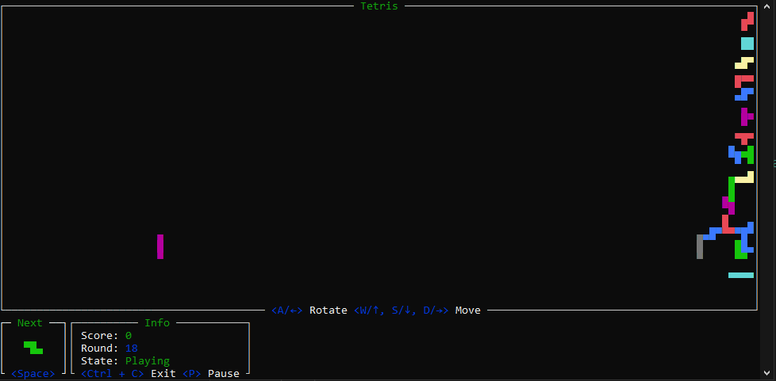

# Tetris in terminal

Learning rust project written with [ratatui](https://ratatui.rs/).



- Needs to be executed in terminal
- Game size is fit to initial terminal size
- Gravity to right
- Shows block shadow at the end
- Controls
    - `Left` / `A` - rotate
    - `Right` / `D` - move forward
    - `Up` / `W` - move up
    - `Down` / `S` - move down
    - `Space` - move to the end (to shadow)
    - `P` - pause (click any control to resume)
    - `R` - Reset the game (only after finished)
    - `Ctrl + C` - exit

## Starting the game

To download dependencies, build and run, use: 
```sh
cargo run
```
or
```sh
cargo run --release
```

The game will begin in terminal. Without terminal the game will not start.